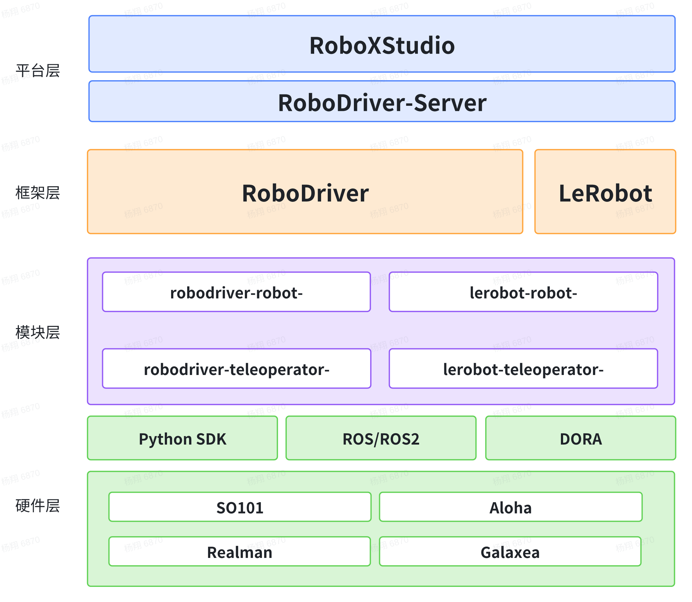

[](https://github.com/FlagOpen/RoboDriver/issues)
[](https://github.com/FlagOpen/RoboDriver/discussions)


[](./README.md)
[](./README_zh.md)


# RoboDriver
RoboDriver是DataCollect的核心驱动层组件，也是[CoRobot](https://github.com/FlagOpen/CoRobot)数据体系中的标准化机器人接入模块。



如图所示，RoboDriver为“设备端驱动适配层”，[RoboDriver-Server](https://github.com/FlagOpen/RoboDriver-Server)是“数据/控制的桥接层与通道路由器”，[RoboXStudio](https://ei2data.baai.ac.cn/home)是“云端或平台侧总控制台与数据管理中心”。

RoboDriver使用文档: [RoboDriver-Doc](https://flagopen.github.io/RoboDriver-Doc)
## 最新消息

- [2025-12-01] RoboDriver项目开源

## 目录

1. [概述](#概述)
2. [主要特点](#主要特点)
3. [快速入门](#快速入门)
4. [参与贡献](#参与贡献)
5. [帮助支持](#帮助支持)
6. [许可证与致谢](#许可证和致谢)
7. [引用](#引用)

## 主要特点

- **多种机器人接入方式**： RoboDriver 考虑了除SDK外，使用ROS、Dora的接入方式。
- **LeRobot兼容**： RoboDriver 的机器人接口直接使用了LeRobot的`Robot`类，这意味着RoboDriver与LeRobot可以互相兼容。
- **改进的LeRobot数据集格式**：在不同数据阶段采取不同数据结构。在采集端单条储存，更易编辑和传输。还扩展了LeRobot格式的内容。

## 快速入门

请参考项目文档：[RoboDriver-Doc](https://flagopen.github.io/RoboDriver-Doc)

## 参与贡献

我们真诚地欢迎来自社区的 *任何形式的贡献*。从**新功能的拉取请求**、**错误报告**，到甚至是使RoboDriver更易用的微小**建议**，我们都全心全意地感谢！

## 帮助支持

- 请使用 Github [Issues](https://github.com/FlagOpen/RoboDriver/issues) 报告错误和提出功能请求。

- 请使用 GitHub [Discussions](https://github.com/FlagOpen/RoboDriver/discussions) 讨论想法和提问。


## 许可证和致谢

RoboDriver 源代码根据 Apache 2.0 许可证授权。 没有这些令人惊叹的开源项目，RoboDriver 的开发是不可能的：

- 感谢LeRobot团队开源LeRobot🤗, [LeRobot](https://github.com/huggingface/lerobot)。本项目由LeRobot改进而来。
- 感谢TheRobotStudio团队开源的SO100和SO101机械臂🤗, [SO101](https://github.com/TheRobotStudio/SO-ARM100)。在本项目中，SO101机械臂作为部署案例。
- 感谢dora-rs团队开源的机器人框架🤗, [dora](https://github.com/dora-rs/dora)。在本项目中，该框架为机器人带来了全新的接入方式。

## 引用

```bibtex
@misc{RoboDriver,
  author = {RoboDriver Authors},
  title = {RoboDriver: A robot control and data acquisition framework},
  month = {November},
  year = {2025},
  url = {https://github.com/FlagOpen/RoboDriver}
}
```
